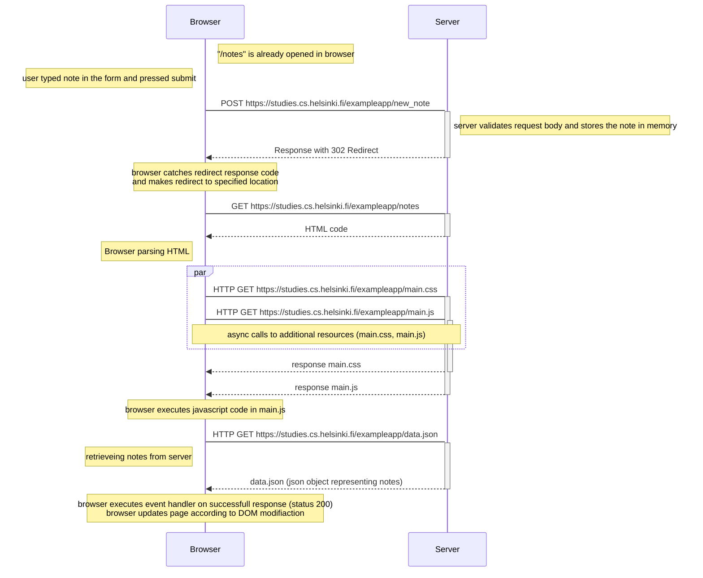

```mermaid
sequenceDiagram
participant Browser
participant Server

note right of Browser: "/notes" is already opened in browser
note left of Browser: user typed note in the form and pressed submit
Browser->+Server: POST https://studies.cs.helsinki.fi/exampleapp/new_note
note right of Server: server validates request body and stores the note in memory
Server-->>-Browser: Response with 302 Redirect

Note over Browser: browser catches redirect response code <br/> and makes redirect to specified location

Browser ->+ Server: GET https://studies.cs.helsinki.fi/exampleapp/notes
Server -->>- Browser: HTML code
note left of Browser: Browser parsing HTML
par 
Browser ->+ Server: HTTP GET https://studies.cs.helsinki.fi/exampleapp/main.css
Browser ->+ Server: HTTP GET https://studies.cs.helsinki.fi/exampleapp/main.js
Note over Browser,Server: async calls to additional resources (main.css, main.js)
end
Server -->>- Browser: response main.css
Server -->>- Browser: response main.js

Note over Browser: browser executes javascript code in main.js

Browser ->+ Server: HTTP GET https://studies.cs.helsinki.fi/exampleapp/data.json
note left of Browser: retrieveing notes from server
Server -->>- Browser: data.json (json object representing notes)

Note over Browser: browser executes event handler on successfull response (status 200) <br/> browser updates page according to DOM modifiaction

```
