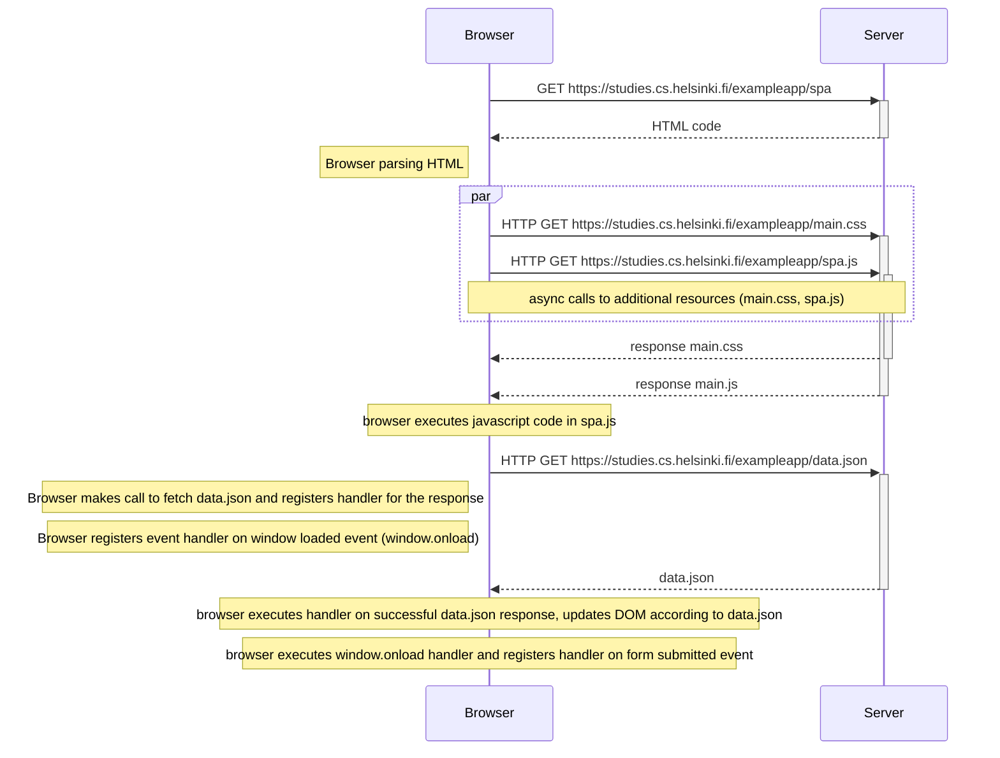

```mermaid
sequenceDiagram
participant Browser
participant Server

Browser->>+Server: GET https://studies.cs.helsinki.fi/exampleapp/spa
Server-->>-Browser: HTML code
note left of Browser: Browser parsing HTML
par 
Browser ->>+ Server: HTTP GET https://studies.cs.helsinki.fi/exampleapp/main.css
Browser ->>+ Server: HTTP GET https://studies.cs.helsinki.fi/exampleapp/spa.js
Note over Browser,Server: async calls to additional resources (main.css, spa.js)
end
Server -->>- Browser: response main.css
Server -->>- Browser: response main.js

Note over Browser: browser executes javascript code in spa.js

Browser ->>+ Server: HTTP GET https://studies.cs.helsinki.fi/exampleapp/data.json
note left of Browser: Browser makes call to fetch data.json and registers handler for the response
note left of Browser: Browser registers event handler on window loaded event (window.onload)
Server -->>- Browser: data.json
Note over Browser: browser executes handler on successful data.json response, updates DOM according to data.json
Note over Browser: browser executes window.onload handler and registers handler on form submitted event

```
