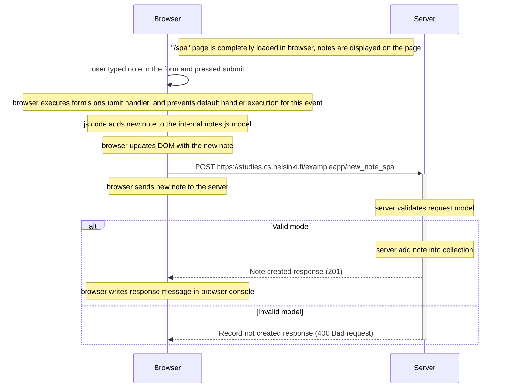

```mermaid
sequenceDiagram
participant Browser
participant Server
note right of Browser: "/spa" page is completelly loaded in browser, notes are displayed on the page
Browser->>Browser: user typed note in the form and pressed submit
note over Browser: browser executes form's onsubmit handler, and prevents default handler execution for this event
note over Browser: js code adds new note to the internal notes js model
note over Browser: browser updates DOM with the new note
Browser->>+Server: POST https://studies.cs.helsinki.fi/exampleapp/new_note_spa
note over Browser: browser sends new note to the server
note over Server: server validates request model
alt Valid model
note over Server: server add note into collection
Server-->>Browser: Note created response (201)
note over Browser: browser writes response message in browser console
else Invalid model
Server-->>-Browser: Record not created response (400 Bad request) 
end

```
